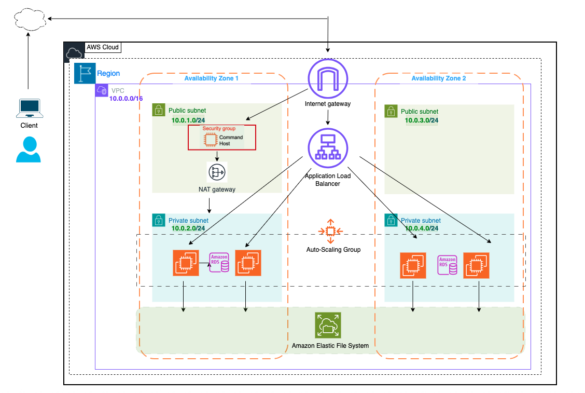

# AWS Capstone Project - Scalable WordPress Infrastructure


## 🚀 Project Overview

This AWS Capstone Project demonstrates the implementation of a **highly available, scalable, and secure WordPress hosting infrastructure** using **Terraform Infrastructure as Code (IaC)**. The architecture follows AWS Well-Architected Framework principles, emphasizing security, reliability, performance efficiency, cost optimization, and operational excellence.

### 🎯 Key Features

- **High Availability**: Multi-AZ deployment across two availability zones
- **Auto Scaling**: Dynamic scaling based on CPU utilization
- **Load Balancing**: Application Load Balancer for traffic distribution
- **Security**: Private subnets for application and database tiers
- **Infrastructure as Code**: Complete infrastructure defined in Terraform
- **Cost Optimized**: Right-sized instances and efficient resource allocation

## 🏗️ Architecture Diagram



## 🏛️ Architecture Components

### Network Infrastructure
- **VPC**: Custom Virtual Private Cloud with CIDR `10.0.0.0/16`
- **Multi-AZ Deployment**: Resources distributed across `us-west-2a` and `us-west-2b`
- **Subnets**:
  - Public Subnet 1: `10.0.1.0/24` (us-west-2a)
  - Public Subnet 2: `10.0.3.0/24` (us-west-2b)
  - Private Subnet 1: `10.0.2.0/24` (us-west-2a)
  - Private Subnet 2: `10.0.4.0/24` (us-west-2b)

### Compute & Scaling
- **Application Load Balancer**: Distributes traffic across WordPress instances
- **Auto Scaling Group**: Maintains 2-3 instances based on CPU utilization (50% threshold)
- **Launch Template**: Automated WordPress deployment with Apache, PHP, and MySQL client
- **Bastion Host**: Secure administrative access to private resources

### Database
- **RDS MySQL 8.0.35**: Managed database service in private subnets
- **Instance Class**: db.t3.micro with 10GB storage
- **High Availability**: DB Subnet Group spans multiple AZs

### Security
- **Security Groups**: Principle of least privilege access control
- **Private Subnets**: Application and database isolation
- **NAT Gateway**: Secure outbound internet access for private resources

## 📋 Prerequisites

Before deploying this infrastructure, ensure you have:

### Required Tools
- **AWS CLI** (v2.x or later) - [Installation Guide](https://docs.aws.amazon.com/cli/latest/userguide/getting-started-install.html)
- **Terraform** (v5.70.0 or later) - [Installation Guide](https://developer.hashicorp.com/terraform/tutorials/aws-get-started/install-cli)
- **Git** - For cloning the repository

### AWS Requirements
- **AWS Account** with appropriate permissions
- **AWS CLI configured** with credentials:
  ```bash
  aws configure
  ```
- **Key Pair** named "vockey" in us-west-2 region.
- **IAM Permissions** for:
  - EC2 (instances, security groups, load balancers)
  - VPC (subnets, route tables, gateways)
  - RDS (database instances, subnet groups)
  - Auto Scaling Groups
  - CloudWatch (for monitoring)

### System Requirements
- **Operating System**: Linux, macOS, or Windows with WSL
- **Internet Connection**: For downloading Terraform providers and AWS resources

## 🚀 Quick Start Guide

### 1. Clone the Repository
```bash
git clone git@github.com:SarikaWirtz/aws-capstone-wordpress-project.git
cd aws-capstone-wordpress-project
```

### 2. Initialize Terraform
```bash
terraform init
```

### 4. Plan the Deployment
```bash
terraform plan
```
Review the planned resources before applying.

### 5. Deploy the Infrastructure
```bash
terraform apply
```
Type `yes` when prompted to confirm the deployment.

### 6. Access Your WordPress Site
After deployment completes (5-10 minutes):
1. Find the ALB DNS name in the Terraform output
2. Open the DNS name in your browser
3. Complete WordPress setup through the web interface

### 7. Administrative Access (Optional)
To access instances via bastion host:
```bash
# Get bastion host public IP from AWS Console
ssh -i vockey.pem ec2-user@<bastion-public-ip>

# From bastion, access private instances
ssh -i vockey.pem ec2-user@<private-instance-ip>
```

### Health Check Verification
- **ALB Target Group**: Check healthy targets in AWS Console
- **Auto Scaling**: Verify instances are running in both AZs
- **Database**: Confirm RDS instance is available

## 🔧 Configuration Details

### Auto Scaling Configuration
- **Desired Capacity**: 2 instances
- **Minimum Size**: 2 instances
- **Maximum Size**: 3 instances
- **Scaling Policy**: Target tracking at 50% CPU utilization
- **Cooldown Period**: 30 seconds

### Database Configuration
- **Engine**: MySQL 8.0.35
- **Instance Class**: db.t3.micro
- **Storage**: 10GB allocated storage
- **Backup**: Skip final snapshot (development environment)
- **Security**: Deployed in private subnets

### Load Balancer Health Checks
- **Path**: `/` (root path)
- **Protocol**: HTTP on port 80
- **Healthy Threshold**: 2 consecutive successful checks
- **Unhealthy Threshold**: 2 consecutive failed checks
- **Interval**: 60 seconds, Timeout: 5 seconds

## 💰 Cost Optimization

This architecture is designed for cost efficiency:

- **t2.micro instances**: AWS Free Tier eligible
- **db.t3.micro RDS**: Minimal database costs
- **Single NAT Gateway**: Reduces NAT charges
- **No encryption**: Avoids additional charges (development use)
- **Minimal storage**: 10GB RDS allocation

**Estimated Monthly Cost**: $15-25 USD (excluding Free Tier benefits)

## 🔒 Security Features

### Network Security
- WordPress instances in private subnets (no direct internet access)
- Bastion host for secure administrative access
- NAT Gateway for controlled outbound connectivity

### Access Control
- Security groups implement least privilege principles
- SSH access only through bastion host
- Database access restricted to application tier
- HTTP/HTTPS traffic controlled through ALB

## 📊 Monitoring & Observability

### Built-in Monitoring
- **CloudWatch Metrics**: CPU utilization for auto scaling
- **ALB Health Checks**: Application availability monitoring
- **RDS Monitoring**: Database performance metrics


